## Biểu đồ Use Case Diagram — Hình 2.1 (overview.png)

Biểu đồ UML Use Case với 1 actor (Giáo viên) và 13 use case trong 4 nhóm bên trong system boundary. Quan hệ `«include»`: UC-08 và UC-09 đều bắt buộc gọi UC-10. Quan hệ `«extend»`: UC-09 là mở rộng tùy chọn của UC-08.

### PlantUML Use Case Diagram — Hình 2.1

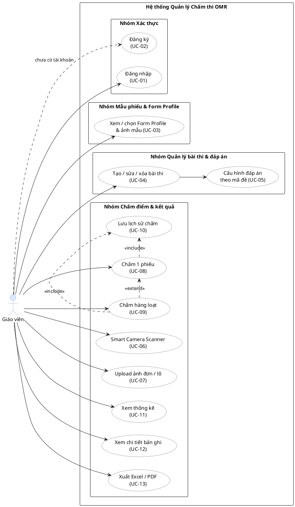

---

## Biểu đồ Activity Diagram — Hình 2.2 (Quy trình nghiệp vụ chấm bài)

@startuml Hinh-2.2-Activity
skinparam defaultTextAlignment left

|Giáo viên|
start
:Đăng nhập / Đăng ký (UC-01, UC-02)\nauth.py — POST /login hoặc POST /auth/google;
:Xem Form Profile & ảnh mẫu (UC-03);
:Tạo / chỉnh sửa bài thi (UC-04)\nassignments.py;
:Cấu hình đáp án theo mã đề (UC-05)\nanswer_sets: {"001": [0,2,1,...], ...};

|Hệ thống|
if (Bài thi có đáp án?) then ([Không])
  :HTTP 400 — "Kho đáp án của bài thi đang trống";
  stop
else ([Có])
endif

|Giáo viên|
if (Cách lấy ảnh?) then ([Camera — UC-06])
  :Smart Camera Scanner\nWebRTC MediaDevices API\nPhân tích frame mỗi 130ms\nAuto-capture khi đủ 4 marker → pickedFiles;
else ([Upload — UC-07])
  :Chọn 1 hoặc nhiều file ảnh từ thư viện\n→ thêm vào pickedFiles;
endif
:Nhấn nút **Chấm bài**;

|Hệ thống|
if (pickedFiles.length > 1?) then ([Có])
  :POST /api/omr/grade-batch (UC-09)\ntối đa 50 ảnh · xử lý tuần tự;
else ([Không])
  :POST /api/omr/grade (UC-08);
endif

if (Lỗi đọc ảnh / warp?) then ([Có])
  :HTTP 400 · Không lưu lịch sử\nbatch: ghi success:false, không dừng lô;
  stop
else ([Không])
endif

:Pipeline OMR — 15 bước\nomr_service.py · process_omr_exam()\nBước 4 · Warp → 1000×1400 px\nBước 5–6 · Xám & nhị phân hóa\nBước 7 · Phát hiện 4 marker\nBước 8–10 · Dựng ROI\nBước 11 · Decode MSSV\nBước 12 · Decode mã đề (3 chữ số)\nBước 13 · Decode MCQ baseline;

if (uncertain ≥ max(4, ⌈0.60×Q⌉)?) then ([Có])
  :Bước 14 · MCQ Map Search Rescue\n54 ứng viên: 6 line_scale × 9 top_shift\nrank = (uncertain↑, double_mark↑, −quality)\nChỉ thay baseline nếu cải thiện đủ;
endif

:Bước 15 · Tính điểm & sinh ảnh\nTra answer_sets theo mã đề từ phiếu\nSo sánh từng câu · overlay màu\nCrop MSSV/MCQ/họ tên · JSON confidence;

:UC-10 · Lưu omr_grade_result\nuid · aid · MSSV · mã đề · điểm\nOverlay · crop · JSON confidence\nCập nhật last_result & graded_count;

if (Chấm lô?) then ([Có])
  :Đóng gói ZIP (ZIP_DEFLATED)\nzip_url · success_count · failed_count;
endif

:Trả JSON kết quả về frontend\nĐiểm · MSSV · Mã đề\nURL overlay · crop · grade_result_id;

|Giáo viên|
fork
  :UC-11 · Xem & lọc thống kê\nStatsPanel.tsx;
fork again
  :UC-12 · Xem chi tiết bản ghi\n+ ảnh overlay;
fork again
  :UC-13 · Xuất Excel / PDF\nExportPanel.tsx;
end fork
stop

@enduml

---

## PlantUML Activity Diagram — Hình 2.3 (Quy trình nghiệp vụ tổng thể)

Hình 2.3 được xuất ra 2 ảnh (`usecase_workflow1.png` và `usecase_workflow2.png`) — hai `@startuml` riêng tương ứng.

### Phần A — Luồng người dùng (UC-01 → UC-09) → `usecase_workflow1.png`

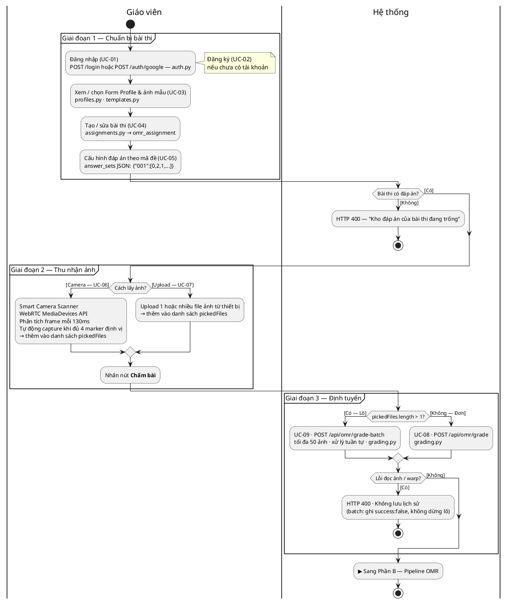

### Phần B — Pipeline & kết quả (UC-10 → UC-13) → `usecase_workflow2.png`

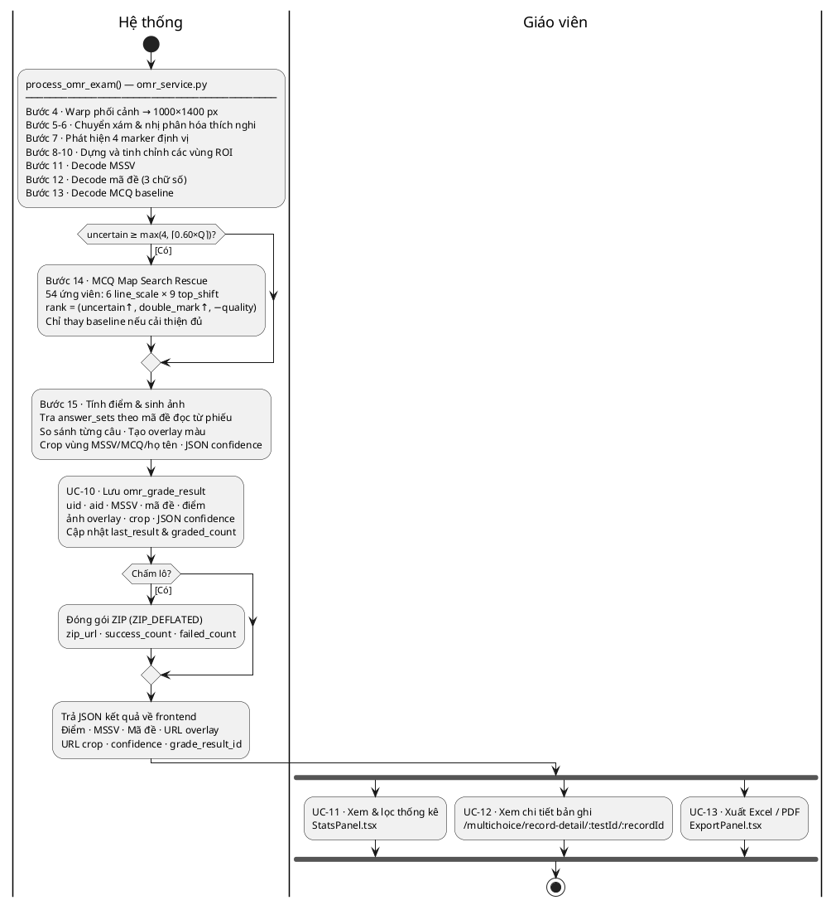

---

## Biểu đồ trình tự — Luồng chấm một phiếu (Hình 4.x)

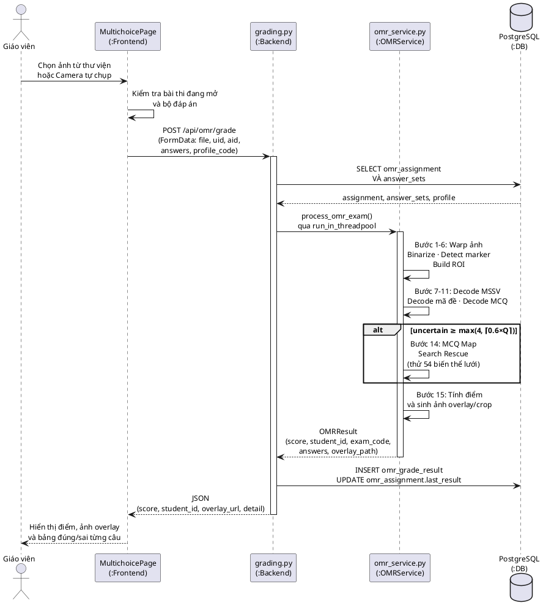

---

## Biểu đồ lớp — Mô hình dữ liệu backend (Hình 4.x)

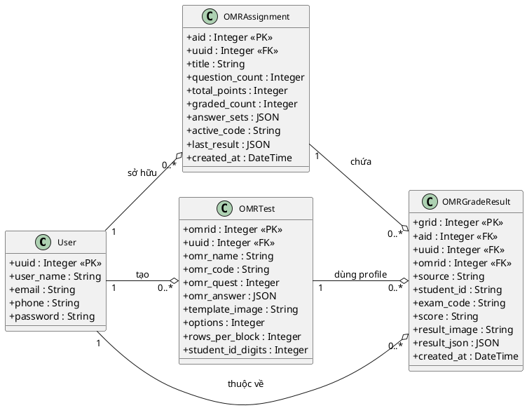

---

## Biểu đồ máy trạng thái — Smart Camera Scanner (Hình 5.x)

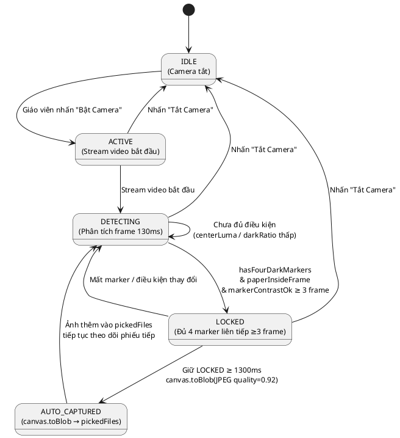

---

## Biểu đồ gói kiến trúc Backend — figures/Backend.png

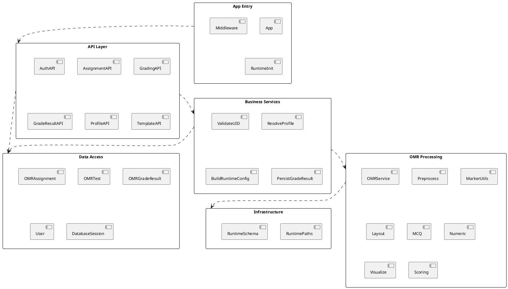

---

## Biểu đồ gói kiến trúc Frontend — figures/Frontend.png

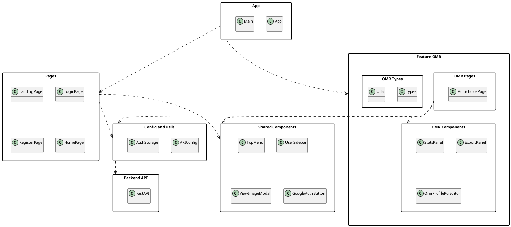

---

## Biểu đồ ERD — Mô hình cơ sở dữ liệu — figures/ERD.png

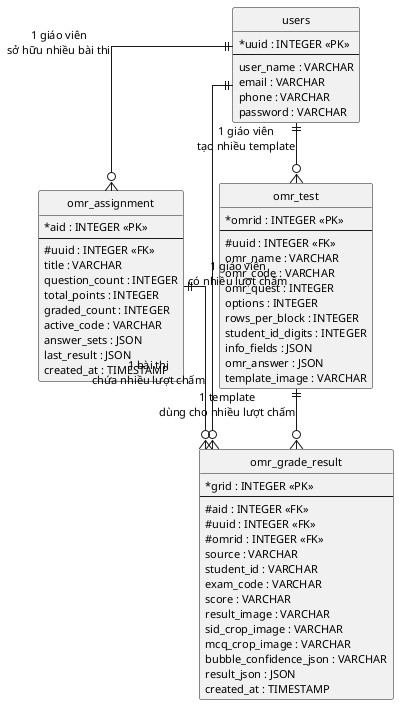

---

## Biểu đồ hoạt động — Pipeline xử lý ảnh OMR 15 bước — figures/activity_diagram.png

```plantuml
@startuml OMR-Pipeline-15-Steps
skinparam defaultTextAlignment left
skinparam defaultFontSize 11
skinparam ActivityBorderColor #555555
skinparam ActivityBackgroundColor #f8f8f8
skinparam ActivityDiamondBorderColor #d6b656
skinparam ActivityDiamondBackgroundColor #fff2cc

start

:Bước 1 · Nhận request và đọc ảnh\nomr_service.py — cv2.imread()\nLưu file upload vào thư mục runtime\n→ Ma trận ảnh BGR;

if (Đọc ảnh thành công?) then ([Không])
  #ffcccc:HTTP 400 — không lưu lịch sử;
  stop
else ([Có])
endif

:Bước 2 · Chuẩn hóa tham số bài thi\nSố câu · số lựa chọn · số dòng/block\nSố chữ số MSSV · mã Form Profile;

if (Profile có crop quad?) then ([Có])
  :Bước 3 · Cắt ảnh ban đầu\nLoại bỏ vùng thừa ngoài tờ giấy;
else ([Không — bỏ qua])
endif

:Bước 4 · Chuẩn hóa phối cảnh toàn trang\nomr_preprocess.py\n① Corner-markers: dùng tâm 4 marker góc\n② Page-contour: Canny → approxPolyDP (4 điểm)\n③ Resize-only (fallback)\ncv2.getPerspectiveTransform → warpPerspective\n→ Ảnh chuẩn 1000×1400 px;

:Bước 5 · Chuyển xám & cân bằng nền\ncv2.cvtColor(BGR2GRAY)\nMorphology Close (ellipse k×k) → ước lượng nền cục bộ\ncv2.divide(gray, bg, scale=255) → chuẩn hóa ánh sáng\nGaussianBlur 3×3;

:Bước 6 · Nhị phân hóa ảnh\nomr_preprocess.py — profile_threshold_mode\n① Otsu: ngưỡng toàn cục tự động\n② Adaptive Gaussian: block 35×35, C=7\n③ Hybrid: bitwise_or(Otsu, Adaptive)\n→ Ảnh nhị phân đảo màu + MORPH_OPEN 2×2;

:Bước 7 · Phát hiện marker định vị\nomr_marker_utils.py\nTìm vùng đen đúng kích thước và hình dạng\n→ Tọa độ marker / anchor;

:Bước 8 · Suy luận hình học vùng MCQ\nomr_layout.py\nSố block · khoảng cách dòng (line_height)\nVị trí dòng đầu tiên trong mỗi block;

:Bước 9 · Dựng các ROI cần đọc\nomr_layout.py\nROI MSSV · ROI mã đề · ROI MCQ · ROI họ tên\nDựa trên profile + marker + ảnh đã warp;

:Bước 10 · Tinh chỉnh ROI vùng MCQ\nHiệu chỉnh sai lệch vài pixel theo chiều dọc\nDựa trên marker nội bộ hoặc cấu trúc lưới;

:Bước 11 · Decode MSSV\nomr_numeric.py — _decode_numeric_columns()\nLưới D cột × 10 hàng (chữ số 0–9)\nScore = 0.55×fill + 0.30×dark + 0.15×P₂₅\nAuto-switch nếu phát hiện lệch write-row;

:Bước 12 · Decode mã đề\nomr_numeric.py — 3 cột × 10 hàng\nZero-padding → tra answer_sets → chọn bộ đáp án;

:Bước 13 · Decode MCQ baseline\nomr_mcq.py — _decode_mcq_with_map()\nLưới (câu × lựa chọn) · dynamic_mark tự điều chỉnh\nPhát hiện: double-mark · noise gate · uncertain_questions;

if (uncertain ≥ max(4, ⌈0.60×Q⌉)?) then ([Có — kích hoạt Rescue])
  :Bước 14 · MCQ Map Search Rescue\nomr_mcq.py\n54 ứng viên: 6 line_scale × 9 top_shift\nrank = (uncertain↑, double_mark↑, −quality)\nChỉ thay baseline nếu đủ điều kiện bảo thủ\nghi MCQ_MAP_SEARCH_RESCUE → warning_codes;
else ([Không — giữ kết quả baseline])
endif

:Bước 15 · Tính điểm, lưu kết quả & sinh ảnh kiểm tra\nomr_scoring.py · omr_visualize.py · shared.py\nTra answer_sets theo mã đề đọc từ phiếu\nSo sánh từng câu → điểm + đúng/sai/bỏ/uncertain\nTạo overlay màu · crop MSSV/MCQ · JSON confidence\nINSERT omr_grade_result · UPDATE last_result & graded_count;

stop
@enduml
```

---

## Biểu đồ hoạt động — Cơ chế tự hiệu chỉnh lưới câu hỏi (MCQ Map Search Rescue) — figures/MCQ_Map_Search_Rescue.png

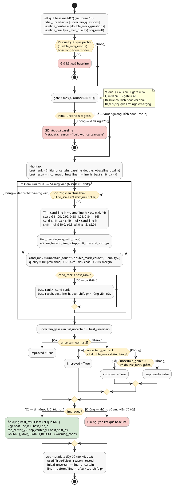

---

## Luồng chấm một phiếu — figures/seq_grade_single.png

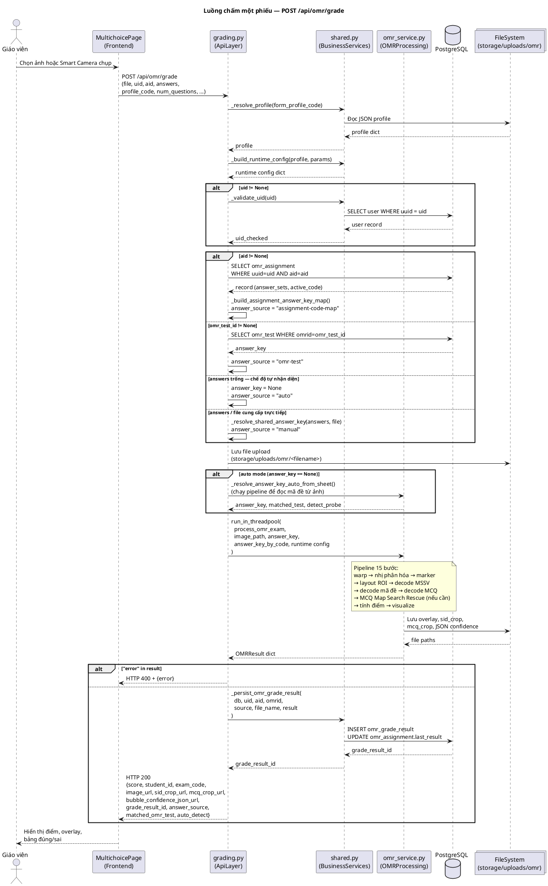

---

## Luồng chấm hàng loạt — figures/seq_grade_batch.png

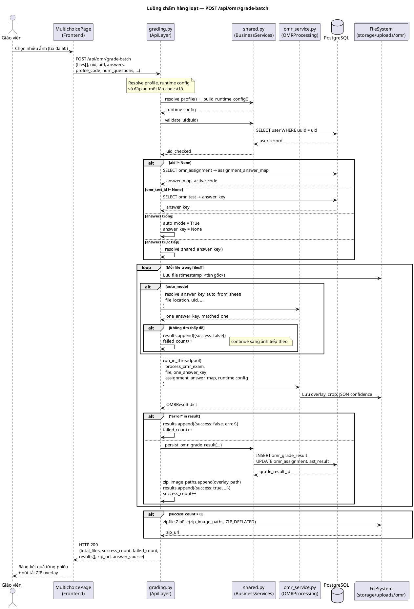

